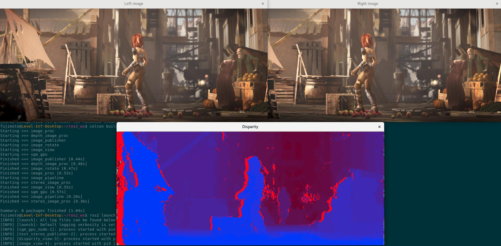

# Semi-Global Matching on GPU for ROS2

`sgm_gpu` is a ROS2 package based on [Semi-Global Matching on the GPU by D. Hernandez-Juarez](https://github.com/dhernandez0/sgm) .

It contains library, component and node to estimate disparity image from stereo images using NVIDIA GPU.



## Build

Prerequisite: ROS2 Eloquent in Ubuntu 18.04

1. [Create a workspace for colcon](https://index.ros.org/doc/ros2/Tutorials/Workspace/Creating-A-Workspace/) if you don't have
2. [Install rosdep](http://wiki.ros.org/rosdep#Installing_rosdep)
3. Put sources in the workspace

   ```bash
   cd <the workspace>
   git clone https://github.com/fujimo-t/ros2_sgm_gpu.git src/sgm_gpu
   # image_view package is needed to visualize disparity
   # Clone it because apt package for Eloquent is still unavailable
   git clone -b ros2 https://github.com/ros-perception/image_pipeline.git src/image_pipeline
   ```

4. Install dependencies by rosdep

   ```bash
   # If you have not installed CUDA
   sudo rosdep install -i --from-path src -y
   # If you have installed CUDA
   sudo rosdep install -i --from-path src -y --skip-keys="nvidia-cuda-dev nvidia-cuda"
   ```

5. Build

   ```
   colcon build
   ```

## Test

```bash
ros2 launch sgm_gpu sgm_gpu_test.py
```

Then viewers for input stereo images and output disparity are opened like above screenshot.

## Node: sgm_gpu_node

Estimate and publish disparity image from stereo image.

### Published topic

* `~/disparity` (stereo_msgs/DisparityImage)

### Subscribed topics

Remap them to topics from stereo camera.

* `left_image` (sensor_msgs/Image)
* `right_image` (sensor_msgs/Image)
* `left_camera_info` (sensor_msgs/CameraInfo)
* `right_camera_info` (sensor_msgs/CameraInfo)

### Parameter

* `image_transport` (string, default: "raw")

  See [image_transport's documentation](https://wiki.ros.org/image_transport).

## Component: sgm_gpu::SgmGpuNode

Component version of the node.

